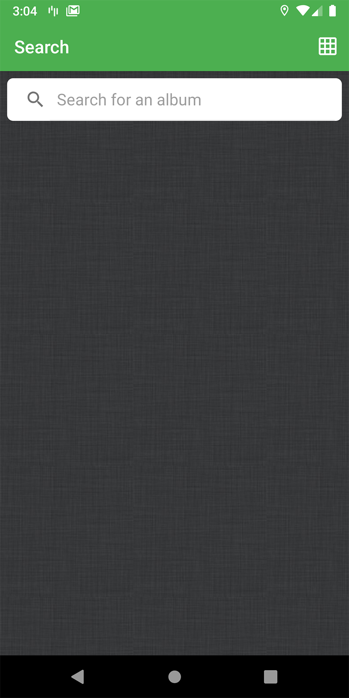
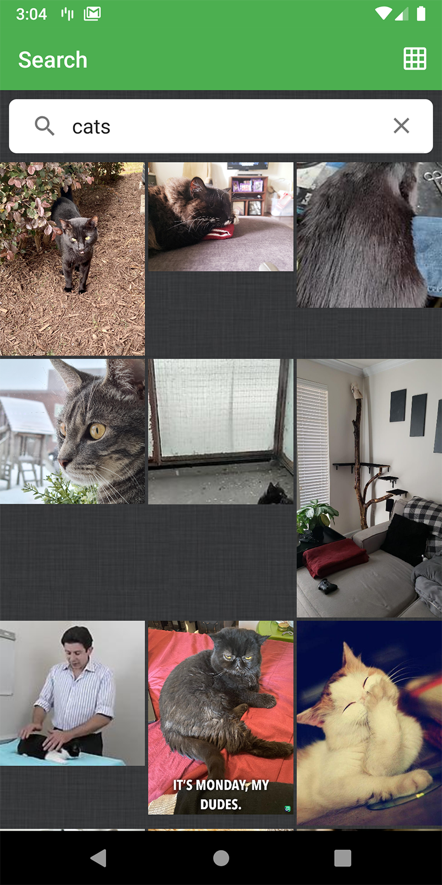

imgur gallery
=========================

A simple imgur album browsing app illustrating current Android Architecture state using Android development best
practices.

Introduction
------------

The application uses Clean Architecture based on MVVM and Repository patterns. Implemented
Architecture principles follow Google recommended [Guide to app architecture](https://developer.android.com/jetpack/docs/guide).

The application is written entirely in Kotlin.

Android Jetpack is used as an Architecture glue including but not limited to ViewModel, LiveData,
Lifecycles, Navigation, Data Binding. See a complete list in "Libraries used" section.

The application does network HTTP requests via Retrofit, OkHttp and GSON.

Kotlin Coroutines manage background threads with simplified code and reducing needs for callbacks.
Combination of Coroutines and Kotlin build in functions (transformation, collections).

Navigation component manages in-app navigation.

Dagger 2 is used for dependency injection.

Glide is used for image loading and Timber for logging.

Google EXO Player for playing videos.

Stetho is used to empower debugging skills (like Network calls log, Database content overview,
UI Hierarchy view, etc).

A sample app consist of 3 screens: Search screen that shows a list view of searched albums, Gallery screen of album clicked on, Single image screen for pinch zoom.

Getting Started
---------------
This project uses the Gradle build system. To build this project, use the
`gradlew build` command or use "Import Project" in Android Studio.

Screenshots
-----------

Libraries Used
--------------

The application goal is to show case current Android Architecture state using out of box
Android tools made by Google (Android Jetpack) and 3rd party community driven libraries.

Android Jetpack is a set of components, tools and guidance to make great Android apps. They bring
together the existing Support Library and Architecture Components and arranges them into four
categories:

* [Foundation][0] - Components for core system capabilities, Kotlin extensions and support for
  multidex and automated testing.
  * [AppCompat][1] - Degrade gracefully on older versions of Android.
  * [Android KTX][2] - Write more concise, idiomatic Kotlin code.
  * [Test][4] - An Android testing framework for unit and runtime UI tests.
* [Architecture][10] - A collection of libraries that help you design robust, testable, and
  maintainable apps. Start with classes for managing your UI component lifecycle and handling data
  persistence.
  * [Data Binding][11] - Declaratively bind observable data to UI elements.
  * [Lifecycles][12] - Create a UI that automatically responds to lifecycle events.
  * [LiveData][13] - Build data objects that notify views when the underlying database changes.
  * [Navigation][14] - Handle everything needed for in-app navigation.
  * [ViewModel][15] - Store UI-related data that isn't destroyed on app rotations. Easily schedule
     asynchronous tasks for optimal execution.
* [UI][30] - Details on why and how to use UI Components in your apps - together or separate.
  * [Fragment][34] - A basic unit of composable UI.
  * [Layout][35] - Lay out widgets using different algorithms.
  * [Material][36] - Material Components.
* Third party
  * [Kotlin Coroutines][91] for managing background threads with simplified code
     and reducing needs for callbacks.
  * [Dagger 2][92] A fast dependency injector.
  * [Retrofit 2][93] A configurable REST client.
  * [OkHttp 3][94] A type-safe HTTP client.
  * [GSON][95] A Json - Object converter using reflection.
  * [Glide][90] Image loading.
  * [Timber][96] A logger.
  * [Stetho][97] Sophisticated debug bridge.
  * [Exo Player][98] Video Player

[0]: https://developer.android.com/jetpack/components
[1]: https://developer.android.com/topic/libraries/support-library/packages#v7-appcompat
[2]: https://developer.android.com/kotlin/ktx
[4]: https://developer.android.com/training/testing/
[10]: https://developer.android.com/jetpack/arch/
[11]: https://developer.android.com/topic/libraries/data-binding/
[12]: https://developer.android.com/topic/libraries/architecture/lifecycle
[13]: https://developer.android.com/topic/libraries/architecture/livedata
[14]: https://developer.android.com/topic/libraries/architecture/navigation/
[15]: https://developer.android.com/topic/libraries/architecture/viewmodel
[30]: https://developer.android.com/guide/topics/ui
[31]: https://developer.android.com/training/animation/
[34]: https://developer.android.com/guide/components/fragments
[35]: https://developer.android.com/guide/topics/ui/declaring-layout
[36]: https://material.io/develop/android/docs/getting-started/
[90]: https://bumptech.github.io/glide/
[91]: https://kotlinlang.org/docs/reference/coroutines-overview.html
[92]: https://dagger.dev/users-guide
[93]: https://square.github.io/retrofit/
[94]: https://square.github.io/okhttp/
[95]: https://github.com/google/gson
[96]: https://github.com/JakeWharton/timber
[97]: http://facebook.github.io/stetho/
[98]: https://github.com/google/ExoPlayer

Android Studio IDE setup
------------------------
For development, the latest version of Android Studio is required. The latest version can be
downloaded from [here](https://developer.android.com/studio/).

- Close Android Studio if it's open

- Start Android Studio

License
-------

Copyright 2021 Michael Shaffer.

Licensed to the Apache Software Foundation (ASF) under one or more contributor
license agreements.  See the NOTICE file distributed with this work for
additional information regarding copyright ownership.  The ASF licenses this
file to you under the Apache License, Version 2.0 (the "License"); you may not
use this file except in compliance with the License.  You may obtain a copy of
the License at

  http://www.apache.org/licenses/LICENSE-2.0

Unless required by applicable law or agreed to in writing, software
distributed under the License is distributed on an "AS IS" BASIS, WITHOUT
WARRANTIES OR CONDITIONS OF ANY KIND, either express or implied.  See the
License for the specific language governing permissions and limitations under
the License.
